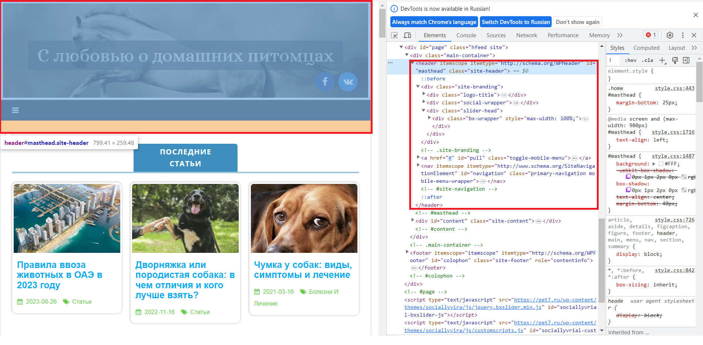
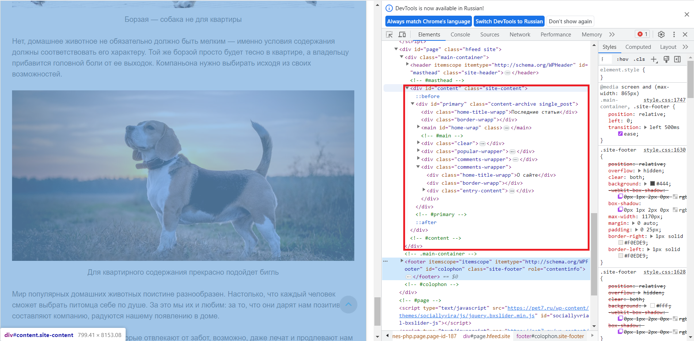
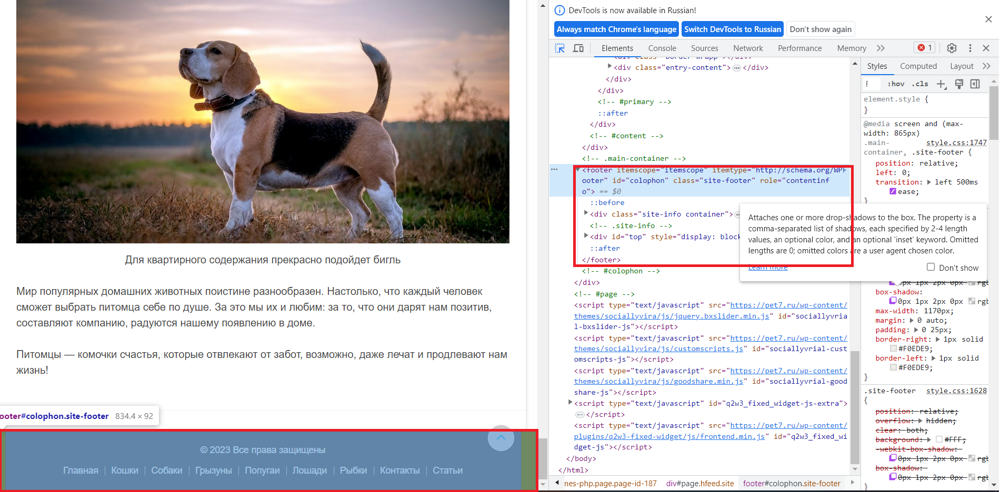
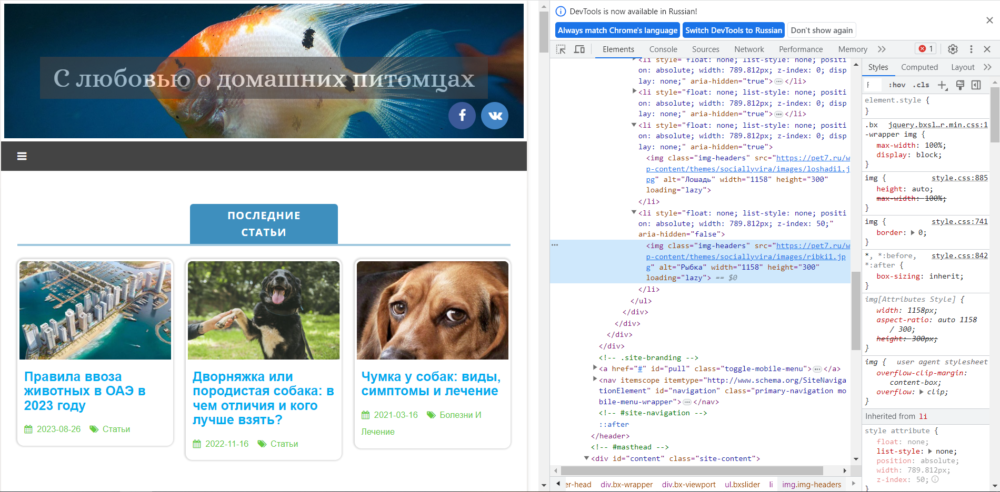
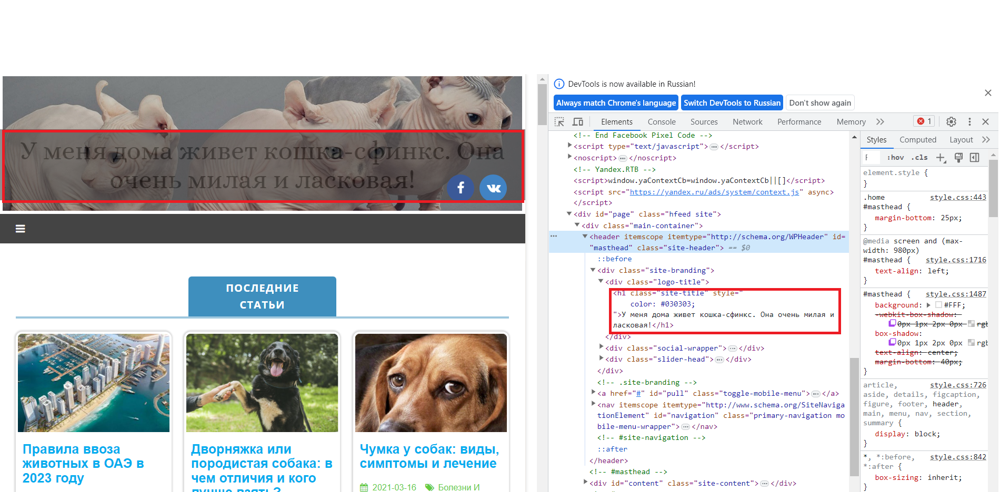
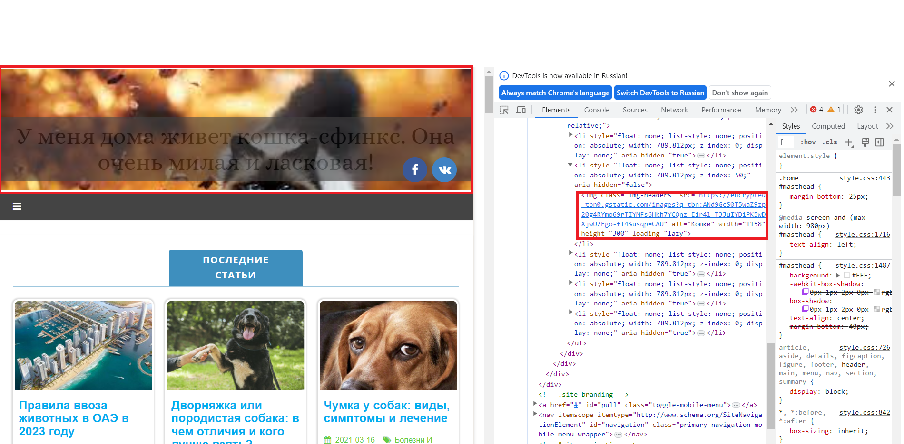
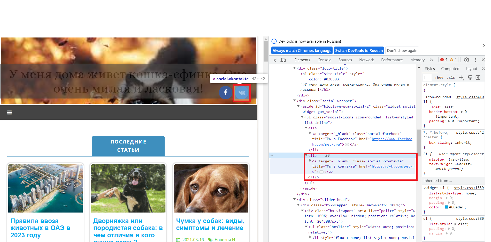
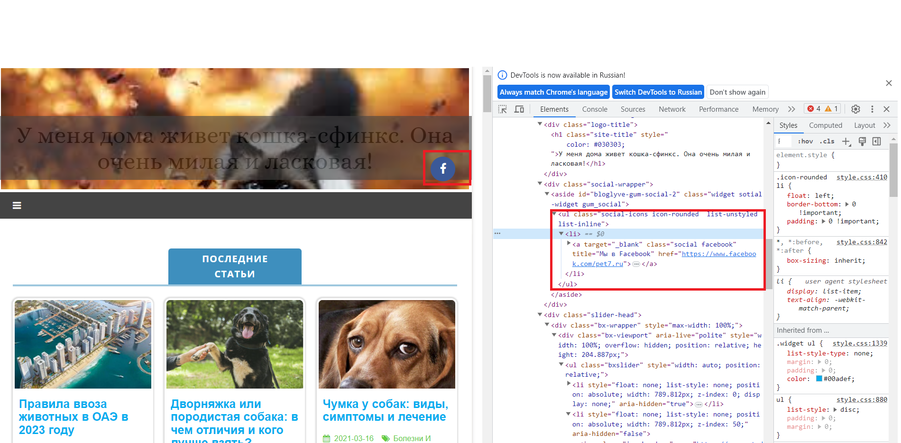

# Первая практика
## Задание:
 На основе сайта **https://pet7.ru/**:
1. Определите, на каком протоколе работает сайт.
2. Проанализируйте структуру страницы сайта. Покажите в коде где хедер, футер и контент.
3. Внесите не менее 3 изменений на страницу с помощью инструмента разработчика и представьте скриншоты было/стало.
4. Создайте прототип низкой детализации.

## Решение:
1. Данный сайт работает на защищенном протоколе. У негоустановлен протокол **https**, который предназначен для безопасного соединения. 
2. Заголовок (Header) страницы заключен в между открывающимся и закрывающимся тегом header:

***
Контент страницы заключен в стандартный тег div:

***
Футер (footer) заключен в открывающийся и закрывающийся тег footer:

***
3. Изменения на странице:
* Изменение надписи и цвета текста в заголовке страницы
***
* Было:

Стало:

***
* Изменение картики в заголовке на фотографию другой кошки
***
* Было:

* Стало:

***
* Удаление элемента кнопка "VK"
***
* Было 
* Стало 
*** 
4. Прототип низкой детализации сайта:

***
Спасибо за внимание!
***

